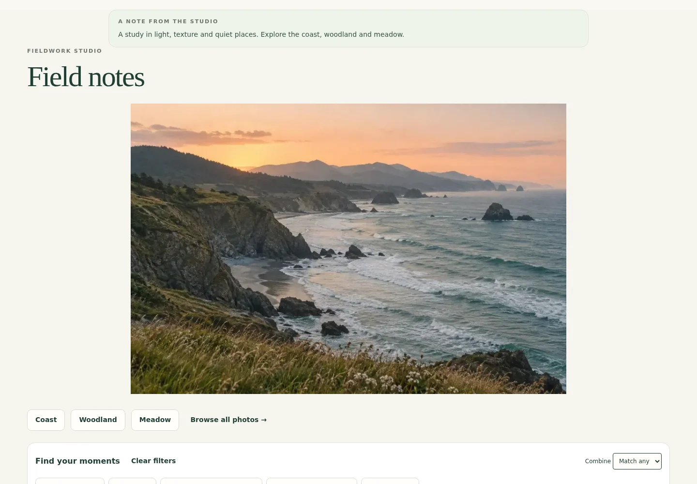
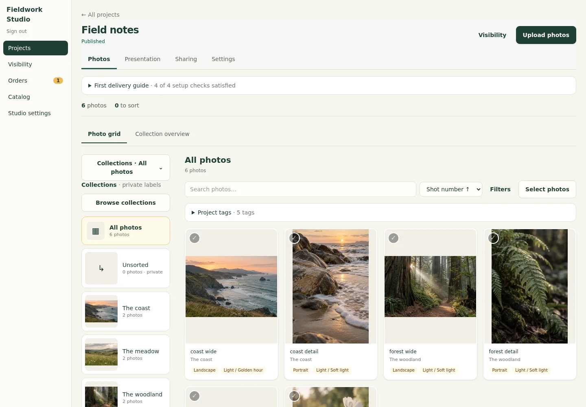
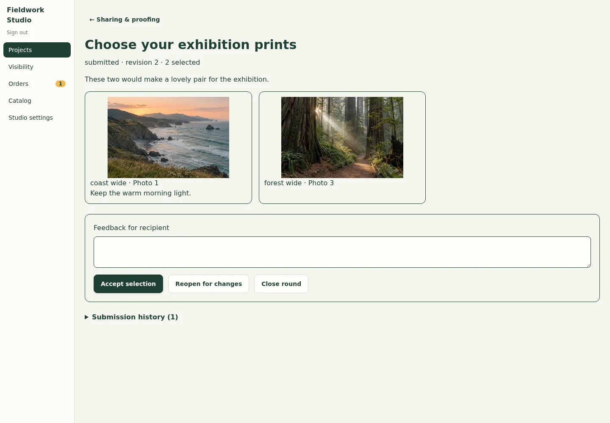

# Gatherframe

### Your photos. Your workflow. Your server.

Self-hosted photo galleries for photographers and small studios. Organize a shoot,
share a considered gallery, collect client selections, and deliver finished files.
Keep editing in Lightroom or your preferred editor; Gatherframe handles the handoff.

[Take the visual tour](docs/product-tour.md) · [Try the read-only demo](https://gatherframe.coldstartlab.com/g/field-notes) · [Self-host it](#quick-start-docker-compose) · [Your first delivery](docs/first-delivery.md)



*Real application screens with original AI-generated sample photography and fictional records.
[Capture details](docs/screenshots/README.md). Screenshots follow this source revision; the hosted demo may run an earlier release.*

## From shoot to delivery

| For the photographer | For the client |
| --- | --- |
| Import finished exports and keep matching file versions together. | Browse a simple gallery, a chaptered story, or a collection directory. |
| Organize one photograph into several collections without duplicating the original. | Explore by collection or tags, then view photos full-screen on a phone. |
| Share selected collections through expiring, revocable invitations. | Save a proof-selection draft, add notes, and submit choices to the photographer. |
| Review selections, reopen a round for changes, or accept it. | Download the file versions the photographer has enabled. |
| Optionally track print orders, manual payments and production. | Order available prints when sales are enabled for the project. |

| Organize your shoot | Review client selections |
| --- | --- |
|  |  |

[See all eight screens and the end-to-end workflow →](docs/product-tour.md)

## What it includes

- [Gallery presentation](docs/gallery-presentation.md): three layouts, public titles separate from private labels, and independent photo/collection ordering.
- [Scoped invitations and proofing](docs/scoped-sharing-and-proofing.md): collection-limited access, expiry, revocation, download controls, saved selections and submission history.
- [Named delivery versions](docs/delivery-versions.md): retain your exports or generate optional smaller JPEGs, with custom upload overrides.
- [Resumable uploads and recoverable sorting](docs/upload-and-sorting-recovery.md), Lightroom-friendly JPEG/social/RAW imports and private XMP/ACR companions.
- Browser-local favorites, individual/ZIP downloads, and phone sharing preparation.
- Optional [print preparation](docs/print-fulfillment.md), receipts, manual payment records and exact-master approval.
- First-party [visibility metrics](docs/visibility.md), local storage or optional private [Backblaze B2](docs/b2-storage.md).
- A first-delivery guide and a [read-only installation doctor](docs/self-hosting.md#read-only-installation-check).

**Early release:** a working single-studio application, not a multi-tenant SaaS platform.
Run one application process per database. Managed hosting is not yet available.
There is no automatic card processing, print-lab fulfillment, face recognition,
automatic media migration, or complete hosted backup service. See the [roadmap](docs/roadmap.md).

## Quick start: Docker Compose

Requires Docker Engine with Compose, Node.js 22 or 24 **only for the optional configuration generator**,
and enough disk for your photos, previews and temporary ZIPs. Linux amd64 is the verified container target.
Clone or download this repository, then run from its root:

```sh
node scripts/init-env.mjs
docker compose build app
SETUP_ENABLED=1 docker compose up -d app
```

Open **http://localhost:3000/setup** on the Docker host and create the first owner.
The default listener is loopback only. On a remote host, use an SSH tunnel as described in
[self-hosting](docs/self-hosting.md); keep public routing disabled during setup.

After creating the owner:

```sh
docker compose up -d --force-recreate app
```

This returns setup to disabled (`SETUP_ENABLED=0` in `.env`). Sign in at **http://localhost:3000/admin**.
The named data volume and signing secret survive recreation. **Do not use `docker compose down -v`**
unless intentionally deleting the instance and its data.

No Node on your server? Copy `.env.example` to `.env`, set `APP_SECRET` to `openssl rand -hex 32`
output, and protect the file with `chmod 600 .env`. Never use an example secret.

Project language is neutral by default; [customize the optional order-reference label](docs/terminology.md) for each project.

## Demo studio

Explore the [sample guest gallery](https://gatherframe.coldstartlab.com/g/field-notes)
or the [read-only studio workspace](https://gatherframe.coldstartlab.com/admin).
The demo uses AI-generated nature photos and fictional orders; edits, uploads and checkout are disabled.
You do not need an account to look around. The demo is not an upload service.

To run your own separate demonstration instance, see [demo mode](docs/demo.md).

## Self-hosting and operations

- [Configuration, HTTPS and owner setup](docs/self-hosting.md)
- [Upgrades, snapshots and recovery](docs/operations.md)
- [Optional B2 storage](docs/b2-storage.md)
- [Managed-instance architecture](docs/managed-hosting.md)
- [Privacy and data handling](docs/privacy.md)
- [User workflows and feature guides](docs/user-guide.md)

## Development

Use Node.js 22 LTS (see `.nvmrc`) or 24, npm, Perl and tar. The Docker image includes its runtime dependencies.

```sh
npm ci
npm run env:init -- --development
npm run dev
```

Visit http://localhost:5173/setup. Development binds loopback; use synthetic photos, not customer data.
The generator never replaces an existing `.env`. If switching from Docker instructions,
set `PUBLIC_ORIGIN` and `ORIGIN` to `http://localhost:5173` and `SETUP_ENABLED=1` deliberately.

```sh
npm run check:repo
npm run check
npm test
npm run test:tools
npm run build
npm run test:smoke
npx playwright install chromium
npm run test:e2e
```

Browser and smoke scripts create disposable data and loopback servers themselves.
Phone tests use Chromium viewport emulation; they do not certify physical iOS sharing.
See [CONTRIBUTING.md](CONTRIBUTING.md) for architecture, testing and review expectations.

## License and source

[AGPL-3.0-only](LICENSE), Copyright 2026 Gatherframe contributors. Commercial hosting is permitted;
modified network versions must meet the license’s source-availability requirements.
Every standard build exposes its corresponding source and license at `/about`.
Your photos and customer records are **not** licensed under AGPL or included in that source download.
The deliberately bundled synthetic documentation samples are identified in the [asset notes](docs/screenshots/README.md).
Dependencies retain their own licenses; see [third-party notices](THIRD_PARTY_NOTICES.md).

For security reports, follow [SECURITY.md](SECURITY.md), not a public issue containing private records.
