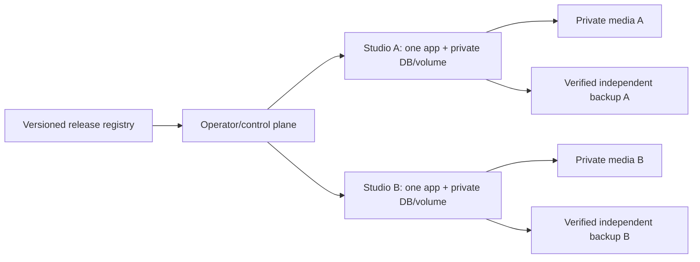

# Managed hosting design

Status: architecture and operating plan, **not a deployed control plane or a service promise**.

## Start with isolated studio instances

One studio gets one application container, SQLite database, data volume, signing secret, hostname and
bucket-scoped storage credentials. Multiple instances may share a compute host but never writable data volumes,
secrets or bucket credentials. Container isolation is not the same as a dedicated VM; offer dedicated hosts only
when actually provisioning them. Use CPU/memory/disk limits and isolate noisy image-processing jobs.

Keep orchestration/billing separate from guest-photo traffic. The initial control plane can be an operator
inventory and reviewed runbooks. Do not expose the Docker socket or fleet credentials to a studio app.
The public application remains the same for self-hosted and managed users.

## Upgrade inventory and rollout

Record tenant ID, hostname, current/previous image digest, schema version, volume identity, secret reference,
backup receipt, storage allocation, maintenance window and last acceptance result. Store secret references,
not plaintext secrets. Schema migrations run inside the single candidate process at startup.

Release state: `built → tested → canary → scheduled → backed-up → stopped → upgraded → verified → accepted`.
On failed health or checks, halt that rollout and assess code/data compatibility before rollback.
Use a synthetic canary first, then an opted-in pilot studio, then small batches with automatic halt on failures.
Never start both old/new writers on the same database. Customer instances can stay pinned temporarily,
but define a supported-version window before taking subscriptions.

Implemented foundations: immutable image release workflow, named persistent volume, stable secret requirements,
health check, closed setup, database snapshot utility, source bundle and unknown-schema refusal.

Still required for paid hosting: reliable active-work draining/maintenance mode, provisioning/deprovisioning,
resource and storage quotas, independent encrypted backups and restore drills, uptime/disk/queue alerts,
customer billing lifecycle, access audit, export/deletion process and operator support procedures.
Current snapshots are database-only and cannot justify a complete hosted backup claim.

## Pricing boundaries

Charge for running the service: setup, updates, monitored hosting, tested recovery and support.
Do not advertise unlimited RAW storage, unlimited transfer, zero downtime or 24/7 support without
measured capacity and staffing. Explicitly account for derivatives, temporary disk, backup copies,
object-store reads and app-host outbound traffic. B2 egress allowances do not cover every app-host network bill.

Leave card checkout/print-lab marketplace work separate from studio subscription billing. Today’s app records
manual cash/payment instructions; it is not a payment processor. Managed service terms and privacy commitments
need to match the implemented controls before launch. AGPL permits commercial hosting, including competing hosts.
