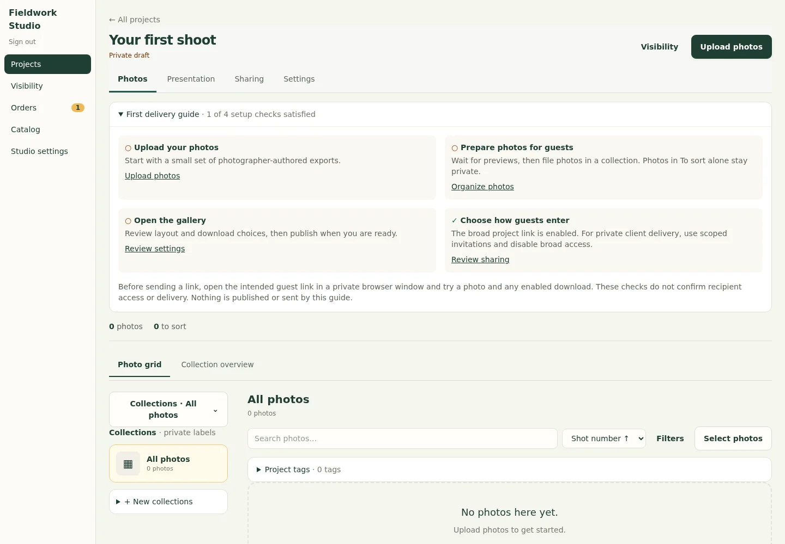
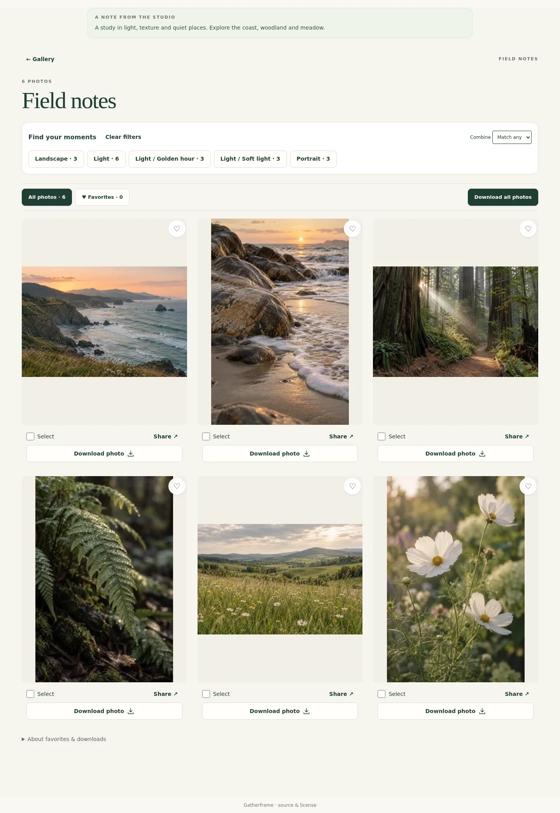
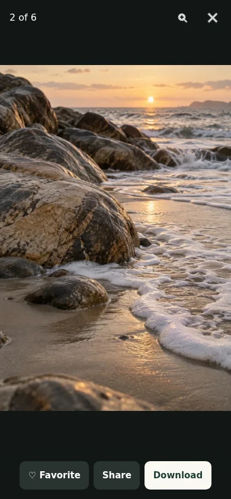
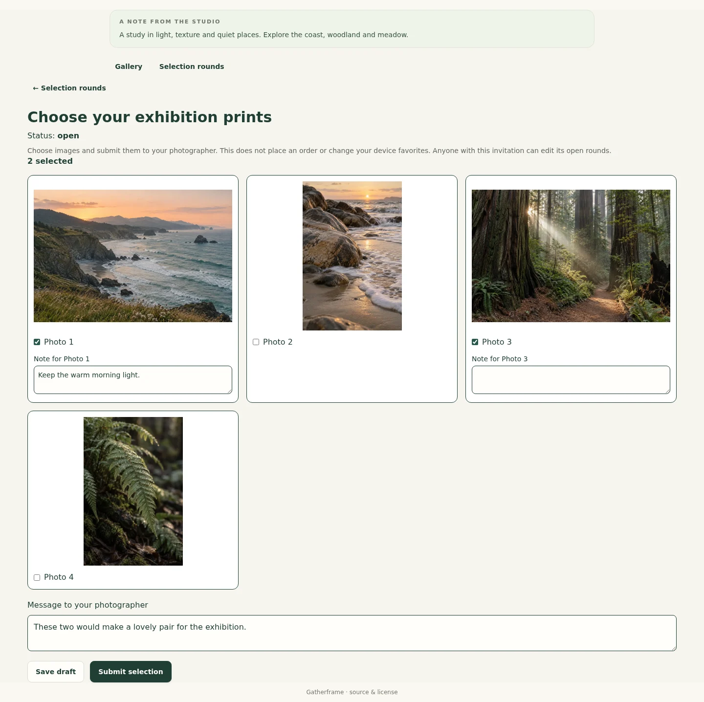
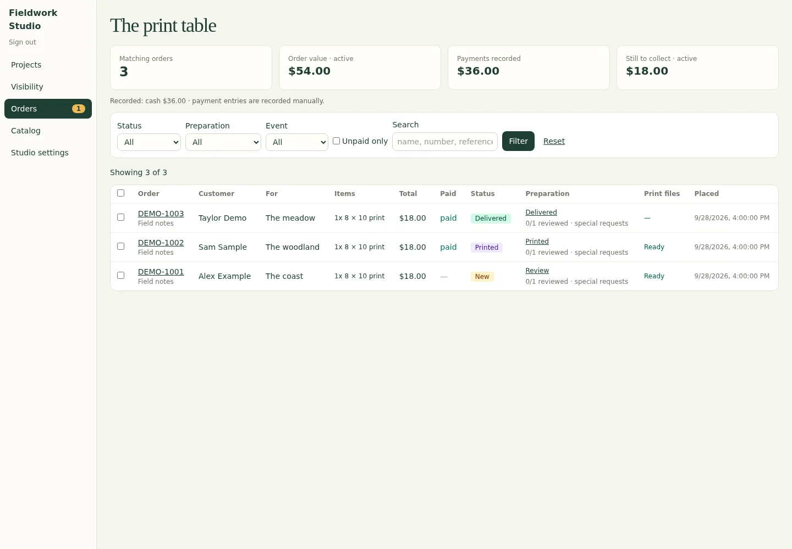

# A shoot, a gallery, a finished delivery

Gatherframe is a self-hosted workspace for photographers who want to keep their
editing tools and control where their photos live. This tour follows **Field notes**,
a fictional nature-photography project, from organizing the shoot to client selections.

[Try the guest demo](https://gatherframe.coldstartlab.com/g/field-notes) · [Explore the studio demo](https://gatherframe.coldstartlab.com/admin) · [Install Gatherframe](../README.md#quick-start-docker-compose)

These are actual application captures, not design mockups. All photos were generated
for the demo, and all client names, notes and orders are fictional. The screenshots
follow the source revision in the [capture manifest](screenshots/manifest.json);
the hosted demo may be on an earlier release. Mobile screens use browser emulation.

## 1. Start privately, with a clear next step

Create a project and follow the first-delivery guide: upload photos, prepare them
for guests, open the gallery, and choose how guests enter. The guide reflects saved
project state. It does not publish a gallery or send invitations for you.

New projects start as private drafts with sales off. You can use Gatherframe just
for gallery delivery. [Walk through your first delivery →](first-delivery.md)

## 2. Organize once, use the photo in several places

Import your finished exports, then sort them into collections. A photo can belong
to multiple collections without duplicating its original. Keep internal collection
labels for studio work; give guests separate public titles and descriptions.
Project tags help people find the images that matter to them.

Matching base filenames keep full-resolution, social and optional RAW versions
attached to one photo. XMP/ACR companions stay private. Gatherframe is not a RAW
editor and does not replace your Lightroom catalog.
[Import and sorting guide →](upload-and-sorting-recovery.md)

## 3. Choose the presentation that fits the shoot

**Simple gallery:** put the photographs directly in front of the client. Visitors
can filter, save browser-local favorites and download enabled files.

**Story/chapters:** give the project a cover and named chapters. The same photos
can tell a more guided story. A third option, **collection directory**, starts with
collection cards—useful when guests need to find their group or session first.

Collection order and photo order are independent. None of these layouts changes
who is allowed to see a photograph. [Presentation guide →](gallery-presentation.md)

## 4. Make the phone experience about the photograph

Tap a photo for the full-screen browser viewer. Swipe between images, pinch or
double-tap to zoom, save a favorite, and open sharing or download options.

Photos retain their proportions. Favorites are local to the visitor's browser;
they are not submitted client selections. Download completion means the server
sent a file, not that a phone saved it into Photos. Native sharing depends on the
device and browser. [Mobile workflow details →](user-guide.md#mobile-galleries)

## 5. Share only the intended collections, then collect decisions

Create a scoped invitation for selected collections, with optional expiry and
download permission. For private delivery, use **scoped links only** so the broad
project link cannot provide another way in. Invitations can be revoked or rotated.

A proof round gives the recipient a saved selection—not just a heart icon on a
thumbnail. Here the sample client chooses two images, leaves an image-specific
note, and saves a draft before submitting.

An invitation is a bearer link: anyone holding it can use its permitted access.
Keep it private. Submission locks the round until the photographer reopens it;
it does not place a print order. [Scoped sharing and proofing →](scoped-sharing-and-proofing.md)

## 6. Review the selection in the studio

The photographer sees the submitted images and notes together. Accept the
selection or send feedback and reopen it for revision. Submission history keeps
the earlier decisions available.

## 7. Keep print sales optional

For projects that sell prints, the print table brings orders, manually recorded
payments, preparation status and delivery progress into one workspace.

This is an order and production workflow, **not automatic payment processing or
print-lab fulfillment**. You remain responsible for collecting payment, approving
the print master and fulfilling the order. [Print preparation guide →](print-fulfillment.md)

## Make your first delivery

1. [Install on your own server](self-hosting.md) and create the studio owner.
2. [Follow the first-delivery walkthrough](first-delivery.md) with a small set of exports.
3. Open the intended guest link in a separate private browser window and verify
   the photos and enabled downloads before sending it to a client.

For backup, upgrade and recovery practices, read [operations](operations.md).
For what is shipped, next, or deliberately deferred, see the [roadmap](roadmap.md).
